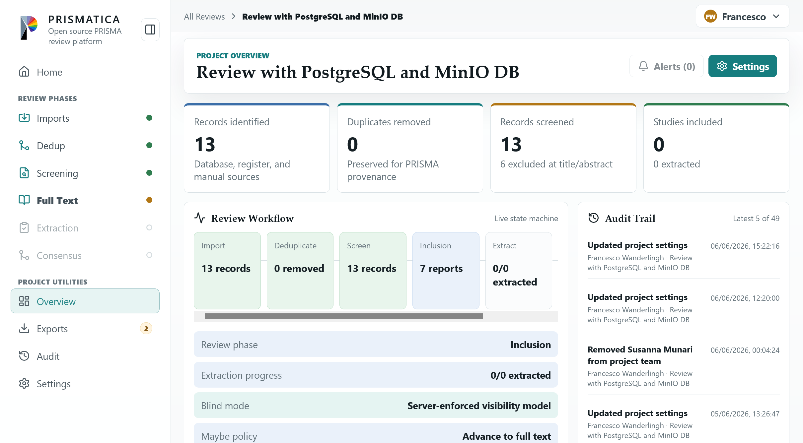

<p align="center">
    
</p>


# PRISMATICA

Open source PRISMA review platform built with Next.js, React, and TypeScript.




## What Is Included

- Project dashboard with PRISMA counts and audit trail
- Sign-in and optional captcha-protected registration screens with HTTP-only server sessions
- Seeded administrator account with admin-only password reset and account deletion controls
- Multi-review dashboard showing each user's accessible review projects
- Project-specific sidebar navigation after opening a review
- Profile page with account details, project membership, and team directory
- New review project form with team membership, EU-format due date (`dd-mm-yyyy`), and screening policy controls
- Project settings team management for adding existing users, inviting new users, and removing non-owner members
- Empty/waiting states for newly created reviews before imports, deduplication, screening, and full-text work begin
- Import batch/provenance view for RIS and BibTeX
- Deduplication candidate review with side-by-side metadata and scoring
- High-velocity title/abstract screening with append-only decision state
- Full-text review workspace with real PDF streaming, upload/validation controls, DOI links, retrieval status, exclusion reasons, and dual-review vote state
- Extraction workflow with owner-created data templates, included-report queue, PDF viewer, reviewer form submission, and two-reviewer submission tracking
- Data template fields for multiline text, single choice, and multiple choice extraction questions
- Per-user project statistics for screened records, uploaded PDFs, full-text reviews, and submitted extractions
- Risk-of-bias workspace scaffold
- PRISMA export preview with validation checks
- Role, blind-mode, and state-machine settings views

Registered users, the seeded administrator account, newly created reviews, team membership, screening decisions, duplicate-candidate statuses, extraction templates, extraction responses, report metadata, and workflow events are stored server-side. By default the Node server writes a JSON data file at `data/prismatica-state.json`; set `PRISMATICA_DATA_FILE` to place it somewhere durable.

This is the Node storage adapter for the current Next.js app. The API routes keep project, user, decision, and audit mutations behind server boundaries so a PostgreSQL/NestJS adapter from `prisma_website_specifications.md` can replace the JSON file later.

## Workflow

1. Create an account, sign in, and create a review project with owners, reviewers, vote thresholds, blind-mode visibility, and maybe-vote policy.
2. Import records from RIS or BibTeX files. Each batch keeps provenance, parser warnings, and editable citation entries.
3. Review deduplication candidates when generated. If no duplicate candidates are produced, screening can continue with the imported citations.
4. Screen titles and abstracts. Reviewers vote include, maybe, or exclude; blind mode hides other reviewers' votes from non-owners while aggregate workflow state is tracked.
5. Advance included studies to full-text review. Upload and validate PDFs, use DOI links for retrieval, set retrieval status, and record full-text include/exclude votes with exclusion reasons.
6. Resolve full-text outcomes. Unanimous include votes advance the report to extraction, unanimous exclude votes exclude it at full text, and mixed include/exclude votes enter conflict resolution.
7. Create the extraction data template. A project owner defines reusable fields as multiline text, single choice, or multiple choice questions.
8. Extract data from included reports. Reviewers work with the PDF viewer on the left and the active extraction template on the right; at least two submitted extractions are tracked for each report.
9. Export and validate PRISMA outputs from the accumulated import, screening, full-text, extraction, and audit state.

## System Dependencies

Prismatica requires Node.js 20.9 or newer and npm.

On Ubuntu/Debian, install the required system dependencies with:

```bash
sudo apt-get update
sudo apt-get install -y ca-certificates curl gnupg

curl -fsSL https://deb.nodesource.com/setup_20.x | sudo -E bash -
sudo apt-get install -y nodejs
```

Verify the installation:

```bash
node --version
npm --version
```

## Install

```bash
npm install
```

## Development Server

```bash
npm run dev -- --hostname 127.0.0.1 --port 3000
```

Open `http://127.0.0.1:3000`.

For encrypted local development, run:

```bash
npm run dev:https -- --hostname 127.0.0.1 --port 3000
```

This uses Next.js experimental HTTPS support with a local certificate.

No demo reviewer accounts are pre-created. Register the first reviewer account from the sign-in screen, then create review projects and invite team members from project settings.

A separate administrator account is created automatically on startup. By default it uses:

- Email: `admin@prismatica.local`
- Password: `change-me-admin`

Use that account to open the Profile page and manage server accounts from the Team Directory, including:

- generating a temporary password for a user who lost access
- deleting a user account

Deleting an account also removes that user from project membership and deletes projects they own.

## Server Storage And Sessions

For production, set a stable session secret and keep the data file outside the repo:

```bash
export PRISMATICA_SESSION_SECRET="replace-with-a-long-random-string"
export PRISMATICA_DATA_FILE="/var/lib/prismatica/prismatica-state.json"
npm run build
npm run start -- --hostname 0.0.0.0 --port 3000
```

Optional environment variables:

```bash
export PRISMATICA_INVITE_PASSWORD="temporary-password-for-invited-users"
export PRISMATICA_ADMIN_EMAIL="admin@example.com"
export PRISMATICA_ADMIN_PASSWORD="replace-this-default-admin-password"
export PRISMATICA_REGISTRATION_ENABLED="false"
export PRISMATICA_CAPTCHA_SECRET="replace-with-a-long-random-string"
export PRISMATICA_SECURE_COOKIES="true"
```

Use `PRISMATICA_SECURE_COOKIES=true` only when the app is served over HTTPS.
`PRISMATICA_REGISTRATION_ENABLED=false` initializes new data files with public registration disabled; administrators can also change this from the Profile page.

For any environment beyond local development, set `PRISMATICA_ADMIN_PASSWORD` explicitly instead of relying on the built-in default.

Uploaded PDFs are stored on disk next to the configured data file, under a `pdfs/` directory. For example, if `PRISMATICA_DATA_FILE` is `/var/lib/prismatica/prismatica-state.json`, uploaded report PDFs are saved under `/var/lib/prismatica/pdfs/<project-id>/`.

## Subnetwork Development Access

For access from another machine on the same subnet, bind the dev server to all interfaces:

```bash
npm run dev -- --hostname 0.0.0.0 --port 3000
```

Then open `http://<server-lan-ip>:3000` from another machine. If the LAN IP changes, add the new IP to `allowedDevOrigins` in `next.config.mjs` and restart the dev server.

## Network-Enabled Public Access

For access from outside the local subnet, build the app and run the production server bound to all interfaces:

```bash
npm run build
npm run start -- --hostname 0.0.0.0 --port 3000
```

Then open `http://<server-hostname-or-ip>:3000`.

If public clients cannot connect:

- Ensure inbound TCP `3000` is allowed by the host firewall and any upstream network firewall.
- Ensure the server process is still running and listening on `0.0.0.0:3000`.

## HTTPS In Production (Let's Encrypt)

Recommended production setup is to keep Next.js on localhost and terminate TLS at Caddy.

1. Point your domain DNS A/AAAA record to this server.
2. Install Caddy on the host.
3. Copy `deploy/caddy/Caddyfile` to `/etc/caddy/Caddyfile` and replace `prismatica.example.com` with your real domain.
4. Build and run Prismatica behind localhost:

```bash
npm install
npm run build
```

5. Install the systemd service from `deploy/caddy/prismatica.service`:

```bash
sudo cp deploy/caddy/prismatica.service /etc/systemd/system/prismatica.service
sudo systemctl daemon-reload
sudo systemctl enable --now prismatica
```

6. Reload Caddy:

```bash
sudo systemctl reload caddy
```

Caddy will automatically request and renew a trusted Let's Encrypt certificate.

Important:

- Keep `PRISMATICA_SECURE_COOKIES=true` in production.
- Keep Next.js bound to `127.0.0.1:3000` when reverse-proxied by Caddy.
- Open inbound TCP ports 80 and 443 in your firewall.

## Type Check

```bash
npm run check
```

## Production Build

```bash
npm run build
```

Run the production server with `npm run start -- --hostname 0.0.0.0 --port 3000`.
